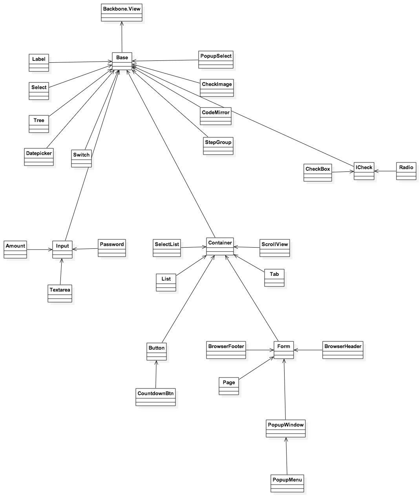
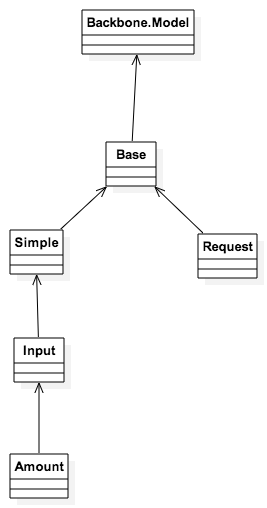

# JS框架组件

----
## 目录结构

  * 目录结构

         HelloWorld/www
          ┣ .bowerrc **功能 : bower配置文件**            
          ┣ bowerScript **功能 : bower的Hook脚本文件**            
          ┣ app                      
          ┃  ┗ index.html                   **功能 : Web端 入口**
          ┣ components                      **功能 : h5客户端 组件目录**
          ┣ css                             **功能 : h5客户端 css目录**
          ┣ lib                             **功能 : h5客户端 第三库引用目录**
          ┣ examples                        **功能 : 示例 Demo，集合所有h5框架封装组件的用法**
          ┣ mockdata                        **功能 : html开发人员 模拟数据请求 目录**
          ┣ make.xml                        **功能 : 对JS、CSS等文件签名、加解密的配置文件**
          ┣ pastry
          ┃  ┣ components                   **功能 : 框架自定义的组件**
          ┃  ┣ core                         **功能 : 框架核心代码**
          ┃  ┣ debug                        **功能 : 框架为项目配置的debug选项集合**
          ┃  ┣ lib                          **功能 : 框架使用的第三方库**
          ┃  ┣ main.js                      **功能 : 框架入口**
          ┗  ┗ plugins                      **功能 : 框架组件依赖的第三方UI组件库**

----
## -------------总览-------------
## Component类图

## 框架UI组件总览
| 组件名称 | 父类 | 功能 | 示例代码 | |
|-----|-----|-----|-----|-----|
| `基础组件` |-----|-----|-----|-----|
| Backbone.View || 组件基类 ||
| `框架基础组件 Component` |-----|-----|-----|
| Base | Backbone.View |||
| Container | Base | 容器组件基类 ||
| Input | Base | 输入框组件 ||
| ICheck | Base | 单多选按钮组件基类 | `待定` |
| `框架扩展组件` |-----|-----|-----|
| Label | Base | 标签组件 ||
| Select | Base | `列表组件` | examples/base_amount.html ||
| CheckImage | Base | 验证码组件 | `待定` ||
| CodeMirror | Base | ？？？？？ | `待定` |
| Datepicker | Base | 日历组件 | examples/data_dispatcher.html ||
| PopupSelect | Base | `弹出框组件` | examples/ex_popupselect.html ||
| StepGroup | Base | 步骤组组件 | `待定` ||
| Switch | Base | 开关按钮组件 | examples/ex_switch.html ||
| Tree | Base | 树形组件 | examples/ex_tree.html ||
| Amount | Input | 金额框组件 | examples/base_amount.html ||
| Password | Input | 密码框组件 | examples/base_password.html ||
| Textarea | Input | 文本域组件 | `待定` ||
| Button | Container | 按钮组件 | examples/base_button.html |
| List | Container | 列表组件 | examples/base_list.html ||
| ScrollView | Container | 滚动区域组件 | examples/ex_scrollview.html ||
| SelectList | Container | 选择列表组件 | examples/ex_selectlist.html ||
| Tab | Container | 选项卡组件 | examples/ex_tab.html ||
| Form | Container | 表单组件 | examples/base_form.html |
| Page | Form | 页签组件 | examples/base_page.html ||
| BrowserHeader | Form | 浏览器顶部栏组件(弃用) | `待定` ||
| BrowserFooter | Form | 浏览器底部栏组件(弃用) | examples/base_header_footer.html ||
| PopupWindow | Form | `弹出框组件` | examples/ex_popupwindow.html ||
| CheckBox | ICheck | 多选按钮组件 | examples/ex_checkbox.html ||
| Radio | ICheck | 单选按钮组件 | examples/ex_radio.html ||
| PopupMenu | PopupWindow | 弹出菜单组件 | examples/ex_popupmenu.html ||
| CountdownBtn | Button | 倒计时按钮组件 | examples/ex_countdownbtn.html |

## 数据模型类图

## 框架数据模型总览

| 模型名称 | 父类 | 功能 | 示例代码 | |
|-----|-----|-----|-----|-----|
| `基础模型` |-----|-----|-----|-----|
| Backbone.Model | - | - | - | - |
| `框架基础组件 Model` |-----|-----|-----|
| Base | Backbone.Model | 组件数据模型基类 | - | - |
| Simple | Base | 简单数据模型,不发请求 | - | - |
| Request | Base | 框架业务数据模型 | - | - |
| Input | Simple  | 输入域数据模型 | - | - |
| Amount | Input | 金融组件数据模型 | - | - |

----
## -------------详细-------------

----
## 通讯组件

----
## 密码键盘
* 功能描述：
